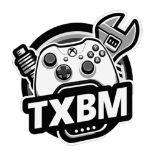
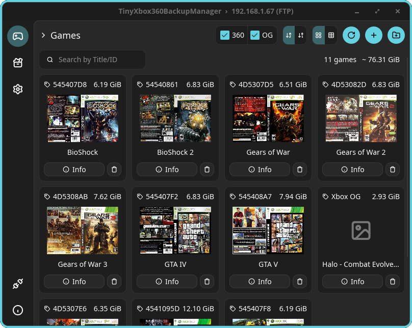

### `TinyXbox360BackupManager`<br><sub><sup>:star: A tiny game backup manager for the Xbox 360</sup></sub>

[](https://github.com/jeanmatthieud/TinyXbox360BackupManager/releases/latest)
[](https://github.com/jeanmatthieud/TinyXbox360BackupManager/blob/main/COPYING)<br />
<a href="https://github.com/sponsors/jeanmatthieud">
  
</a>
<a href="https://ko-fi.com/W6I723OON9">
  
</a>

<br>

> [!CAUTION]
> TinyXbox360BackupManager is intended strictly for legal homebrew use and is not affiliated with or endorsed by Microsoft.
> Use of TinyXbox360BackupManager for pirated or unauthorized copies of games is strictly prohibited.

> [!WARNING]
> This project has just started. The modifications and adaptations from the upstream project are being made with the help of IA.



## Put your game backups on your Xbox 360 — the easy way

You have a modded **Xbox 360** (running the [Aurora](https://phoenix.xboxunity.net) dashboard) and some game backups on your computer.
This app copies them onto your console (or a USB drive) in the format the console understands — **you don't need to know how any of it works.**

- :package: **Drop in your game file, it does the rest** — it figures out the type and prepares it automatically.
- :compass: **It guides you** — when you connect your console or USB drive, it looks at what's already there and suggests where to put your games. You just click **Confirm**.
- :framed_picture: **Covers appear on their own** — box art is downloaded for you.
- :arrows_counterclockwise: **Works both ways** — send games to your console over Wi‑Fi (FTP) or to a USB drive plugged into your PC.
- :feather: **Tiny and self-contained** — one small app, nothing else to install.

It also handles **original Xbox** games, just like the Wii plays GameCube games.
Inspired by [TinyWiiBackupManager](https://github.com/mq1/TinyWiiBackupManager).

## :rocket: Get started in 3 steps

1. **Open the app and pick where your games go.** Click the **hard-drive icon** (bottom-left) and choose your **USB drive** or your **console over Wi‑Fi** (its IP + Aurora login — the defaults `xboxftp` / `xboxftp` usually just work).
2. **Confirm the setup.** A short **Content analysis** window opens, looks at your drive/console, and pre-fills where games should be stored. In most cases you can just click **Confirm** — it remembers your choice, so you only do this once.
3. **Add your games.** Click the **+** button (or drag & drop your files). The app converts/copies each one to the right place. That's it — your games show up in the grid with their covers.

> :bulb: On the console side, Aurora needs to be told which folders to scan. The app checks this for you in the **Toolbox** and, if something is missing, shows you exactly what to add.

<br>

## :arrow_down: Downloads

<table>
  <tr>
    <td width="9999px"><strong>:window: Windows</strong></td>
  </tr>
  <tr>
    <td>
      :arrow_right: <a href="https://github.com/jeanmatthieud/TinyXbox360BackupManager/releases/latest">Download standalone binary</a>
    </td>
  </tr>
</table>

<table>
  <tr>
    <td width="9999px"><strong>:apple: macOS</strong></td>
  </tr>
  <tr>
    <td>
      :arrow_right: <a href="https://github.com/jeanmatthieud/TinyXbox360BackupManager/releases/latest">Download universal DMG</a>
    </td>
  </tr>
</table>

<table>
  <tr>
    <td width="9999px"><strong>:penguin: Linux</strong></td>
  </tr>
  <tr>
    <td>
      :arrow_right: <a href="https://github.com/jeanmatthieud/TinyXbox360BackupManager/releases/latest">Download AppImage</a>
    </td>
  </tr>
</table>

<br>

## :sparkles: What it can do

- **Send games to a console (Aurora over FTP) or a USB drive / local folder.** The game list reflects what's really on the target.
- **Accepts many kinds of input** and picks the right processing automatically: Xbox 360 ISOs, original Xbox ISOs, Arcade (XBLA) archives, install / expansion discs, and bare STFS packages.
- **Multi-disc games with an install disc** (e.g. GTA V) and **Expansion Installer discs** (e.g. GTA IV: The Complete Edition) are handled — just provide both ISOs; DLC and title updates get installed to the right place so unlocks work out of the box.
- **Covers** from [XboxUnity](https://www.xboxunity.net) and [MobCats](https://github.com/MobCat/MobCats-original-xbox-game-list) (with a local cache).
- **Cross-platform**, native, no dependencies to install:
  - :window: Windows 7+ | x86 (32-bit), x64 (64-bit), arm64 (Qualcomm Snapdragon etc.)
  - :apple: macOS 10.14+ | x86_64 (Intel), arm64 (Apple Silicon/M1+)
  - :penguin: Linux (glibc 2.31+) | x86 (32-bit), x86_64 (64-bit), arm64 (Raspberry Pis etc.)

> [!WARNING]
> Title updates for original Xbox (OG) games are not yet supported. Extracting Xbox 360 games (rather than converting them to GOD) is planned but not implemented yet. Homebrew management is intentionally out of scope for now.

<br>

---

## :gear: How it works (technical details)

Everything below is optional reading — the app does it for you.

### Input types and processing

Provide an **ISO** image or an **Arcade (XBLA) game** (a `.7z`/`.zip` archive or a bare STFS package); the app detects the input and converts/installs it:

| Detected input type | Processing | Goes to |
|---|---|---|
| Xbox 360 game ISO (`default.xex`) | Conversion to **GOD** (Games on Demand) | GOD folder → `<TitleID>/00007000/` |
| Original Xbox game ISO (`default.xbe`) | **Extraction** of the content | Extracted-XBE folder → `<Game Name>/` |
| Install / **Expansion Installer** disc (no executable; contains DLC and title updates) | Extraction and merge of the `Content` folder | GOD folder → `<TitleID>/<type>/` |
| **Arcade (XBLA) game** (`.7z`/`.zip` archive) | Extraction, verification of the **Arcade** STFS package (title, TitleID) | GOD folder → `<TitleID>/000D0000/` |
| STFS package (`LIVE`/`CON `/`PIRS`, usually no extension) | Installed as-is per its content type | GOD folder → `<TitleID>/<type>/` |

**DLC and title updates** bundled with an Arcade game in an archive are installed too (respectively in `00000002/` and `000B0000/`), so unlocks work out of the box. They can also be added individually as bare STFS packages.

### Storage folders (guided setup + `.txbm.json`)

The app installs and scans games in **three configurable folders**, one per storage format:

| Format | Default folder | Content |
|---|---|---|
| **GOD** (converted Xbox 360) | `Content/0000000000000000` | `<TitleID>/…` containers |
| **XBE** (extracted original Xbox) | `Games Xbox` | one sub-folder per game (`default.xbe`) |
| **XEX** (extracted Xbox 360) | `Games Xbox360` | one sub-folder per game (`default.xex`) — reserved for the planned 360-extraction feature |

When you connect a target, the **Content analysis** window resolves these folders in this order:

1. a `.txbm.json` file already saved on the target (your confirmed choice — takes priority);
2. the drive's / console's own **Aurora scan paths** (read from Aurora's databases), used to detect where your games already live;
3. built-in defaults (the table above).

You confirm (or adjust) the three folders, and the app writes a small **`.txbm.json`** at the root of the target so it never has to ask again. On a USB drive the paths are stored **relative to the drive**, so it keeps working if the drive is later mounted elsewhere.

### Targets

- **USB drive / local folder (FAT32):** games are written directly in the correct format.
- **Console over FTP (Aurora):** the game list is read from the console, added games are converted locally then pushed to the console; deletion is done remotely. Only **one FTP connection at a time** is used, as required by the console's FTP server.

### Aurora scan paths

Aurora only lists games from folders it is told to scan. The **Toolbox** page reads Aurora's configured scan paths and compares them with the folders this app uses:

- for a **console over FTP**, and for a **USB key that carries an Aurora install**, each storage folder is flagged as scanned by Aurora or not;
- if a folder isn't scanned yet, the app shows the exact path to add in *Aurora → Settings → Content → Manage Paths* (Scan Depth 3+), then a rescan.

## :hammer_and_wrench: Compilation

```sh
cargo build --release
```

Build prerequisites on Linux (Debian/Ubuntu/Pop!_OS):

```sh
sudo apt-get install -y build-essential pkg-config libfontconfig1-dev
```

The binary is generated in `target/release/TinyXbox360BackupManager`.

## :computer: Technologies

Pure Rust, no runtime external dependencies:

- [Slint](https://slint.dev) — graphical interface
- [iso2god-rs](https://github.com/iliazeus/iso2god-rs) — ISO → GOD conversion
- [xdvdfs](https://crates.io/crates/xdvdfs) — reading/extraction of XDVDFS images ([extract-xiso](https://github.com/XboxDev/extract-xiso) equivalent)
- [suppaftp](https://crates.io/crates/suppaftp) — FTP client
- [XboxUnity](https://www.xboxunity.net) — Xbox360 covers and title updates
- [MobCats](https://github.com/MobCat/MobCats-original-xbox-game-list) — Xbox covers

## :scroll: License

GPL-3.0-only. Based on the work of Manuel Quarneti (TinyWiiBackupManager), iliazeus (iso2god-rs) and antangelo (xdvdfs).
