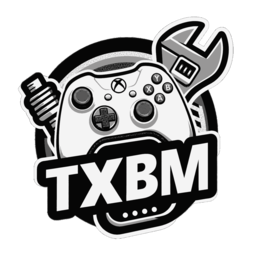
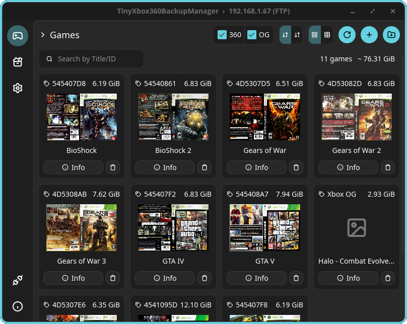

### `TinyXbox360BackupManager`<br><sub><sup>:star: A tiny game backup manager for the Xbox 360</sup></sub>

[](https://github.com/jeanmatthieud/TinyXbox360BackupManager/releases/latest)
[](https://github.com/jeanmatthieud/TinyXbox360BackupManager/blob/main/COPYING)<br />
<a href="https://github.com/sponsors/jeanmatthieud">
  
</a>
<a href="https://ko-fi.com/W6I723OON9">
  
</a>

<br>

> [!CAUTION]
> TinyXbox360BackupManager is intended strictly for legal game backup use and is not affiliated with or endorsed by Microsoft.
> Use of TinyXbox360BackupManager for pirated or unauthorized copies of games is strictly prohibited.

> [!WARNING]
> This project has just started. The modifications and adaptations from the upstream project are being made with the help of IA.



## Put your game backups on your Xbox 360 — the easy way

You have a modded **Xbox 360** (running the [Aurora](https://phoenix.xboxunity.net) dashboard) and some game backups on your computer.
This app copies them onto your Xbox360 (or a USB drive) in the format the console understands — **you don't need to know how any of it works.**

- :package: **Drop in your game file, it does the rest** — it figures out the type and prepares it automatically.
- :compass: **It guides you** — it detects your plugged-in USB drives or remote Xbox360, and once connected, looks at what's already there to suggest where to put your games.
- :framed_picture: **Covers appear on their own** — box art is downloaded for you.
- :arrows_counterclockwise: **Three ways in** — send games to your Xbox360 over Ethernet / Wi‑Fi (FTP), to a USB drive plugged into your PC, or straight onto the **console's own hard drive** connected to your computer (experimental, advanced users).
- :feather: **Tiny and self-contained** — one small app, nothing else to install.

It also handles **original Xbox** games, just like the Wii plays GameCube games.
Inspired by [TinyWiiBackupManager](https://github.com/mq1/TinyWiiBackupManager).

## :rocket: Get started in 3 steps

1. **Open the app and pick where your games go.** Click the **connect icon** (bottom-left), then choose **Local USB drive**, **Xbox 360 internal hard drive** or **Remote Xbox360 over network**. For a USB drive, pick it from the list of detected removable drives (FAT32 only); for the console's own drive — experimental, and reserved for advanced users — connect it to your computer and pick it from the list (see [Using the console's hard drive](#electric_plug-using-the-consoles-hard-drive)); for the remote Xbox360, enter its IP + Aurora login — the defaults `xboxftp` / `xboxftp` usually just work.
2. **Confirm the setup.** A short **Content analysis** window opens, looks at your drive/console, and pre-fills where games should be stored. In most cases you can just click **Confirm** — it remembers your choice, so you only do this once.
3. **Add your games.** Click the **+** button (or drag & drop your files). The app converts/copies each one to the right place. That's it — your games show up in the grid with their covers.

> :bulb: Aurora needs to be told which folders to scan. The app checks this for you in the **Toolbox** and, if something is missing, shows you exactly what to add.

<br>

## :arrow_down: Downloads

<table>
  <tr>
    <td width="9999px"><strong>:window: Windows</strong></td>
  </tr>
  <tr>
    <td>
      :arrow_right: <a href="https://github.com/jeanmatthieud/TinyXbox360BackupManager/releases/latest">Download standalone binary</a>
    </td>
  </tr>
</table>

<table>
  <tr>
    <td width="9999px"><strong>:apple: macOS</strong></td>
  </tr>
  <tr>
    <td>
      :arrow_right: <a href="https://github.com/jeanmatthieud/TinyXbox360BackupManager/releases/latest">Download universal DMG</a>
    </td>
  </tr>
</table>

<table>
  <tr>
    <td width="9999px"><strong>:penguin: Linux</strong></td>
  </tr>
  <tr>
    <td>
      :arrow_right: <a href="https://github.com/jeanmatthieud/TinyXbox360BackupManager/releases/latest">Download AppImage</a>
    </td>
  </tr>
</table>

<br>

## :sparkles: What it can do

- **Send games to a console (Aurora over FTP) or a USB drive / local folder.** The game list reflects what's really on the target.
- **Accepts many kinds of input** and picks the right processing automatically: Xbox 360 ISOs, original Xbox ISOs, Arcade (XBLA) archives, install / expansion discs, and bare STFS packages.
- **Multi-disc games with an install disc** (e.g. GTA V) and **Expansion Installer discs** (e.g. GTA IV: The Complete Edition) are handled — just provide both ISOs; DLC and title updates get installed to the right place so unlocks work out of the box.
- **Covers** from [XboxUnity](https://www.xboxunity.net) and [MobCats](https://github.com/MobCat/MobCats-original-xbox-game-list) (with a local cache).
- **Toolbox** for the jobs that come before the games: build a BadAvatar USB key, and install the original Xbox compatibility files to maximize the compatibility.
- **Cross-platform**, native, no dependencies to install:
  - :window: Windows 10+ | x86 (32-bit), x64 (64-bit), arm64 (Qualcomm Snapdragon etc.)
  - :apple: macOS 10.14+ | x86_64 (Intel), arm64 (Apple Silicon/M1+)
  - :penguin: Linux (glibc 2.31+) | x86 (32-bit), x86_64 (64-bit), arm64 (Raspberry Pis etc.)

> [!WARNING]
> Title updates for original Xbox (OG) games are not yet supported. Homebrew management is intentionally out of scope for now.

<br>

---

## :gear: How it works (technical details)

Everything below is optional reading — the app does it for you.

### Input types and processing

Provide an **ISO** image or an **Arcade (XBLA) game** (a `.7z`/`.zip` archive or a bare STFS package); the app detects the input and converts/installs it:

| Detected input type | Processing | Goes to |
|---|---|---|
| Xbox 360 game ISO (`default.xex`) | Conversion to **GOD** (Games on Demand)<br />*or*<br />**Extraction** of the content | GOD folder → `<TitleID>/00007000/`<br />*or*<br />Extracted-XEX folder → `<Game Name>/` |
| Original Xbox game ISO (`default.xbe`) | **Extraction** of the content | Extracted-XBE folder → `<Game Name>/` |
| Install / **Expansion Installer** disc (no executable; contains DLC and title updates) | Extraction and merge of the `Content` folder | GOD folder → `<TitleID>/<type>/` |
| **Arcade (XBLA) game** (`.7z`/`.zip` archive) | Extraction, verification of the **Arcade** STFS package (title, TitleID) | GOD folder → `<TitleID>/000D0000/` |
| STFS package (`LIVE`/`CON `/`PIRS`, usually no extension) | Installed as-is per its content type | GOD folder → `<TitleID>/<type>/` |

**DLC and title updates** bundled with an Arcade game in an archive are installed too (respectively in `00000002/` and `000B0000/`), so unlocks work out of the box. They can also be added individually as bare STFS packages.

For Xbox 360 games, the choice between **GOD conversion** and **XEX extraction** is not automatic — it's a user setting. On the Settings page, a dropdown lets you pick the target format.

### Storage folders (guided setup + `.txbm.json`)

The app installs and scans games in **three configurable folders**, one per storage format:

| Format | Default folder | Content |
|---|---|---|
| **GOD** (converted Xbox 360) | `Content/0000000000000000` | `<TitleID>/…` containers |
| **XBE** (extracted original Xbox) | `Games Xbox` | one sub-folder per game (`default.xbe`) |
| **XEX** (extracted Xbox 360) | `Games Xbox360` | one sub-folder per game (`default.xex`) — reserved for the planned 360-extraction feature |

When you connect a target, the **Content analysis** window resolves these folders in this order:

1. a `.txbm.json` file already saved on the target (your confirmed choice — takes priority);
2. the drive's / console's own **Aurora scan paths** (read from Aurora's databases), used to detect where your games already live;
3. built-in defaults (the table above).

You confirm (or adjust) the three folders, and the app writes a small **`.txbm.json`** at the root of the target so it never has to ask again. On a USB drive the paths are stored **relative to the drive**, so it keeps working if the drive is later mounted elsewhere.

### Targets

- **USB drive / local folder (FAT32):** plugged-in removable drives are auto-detected and listed, with non-FAT32 ones flagged as unsupported; games are then written directly in the correct format.
- **Xbox360 over FTP (Aurora):** the game list is read from the console, added games are converted locally then pushed to the console; deletion is done remotely. Only **one FTP connection at a time** is used, as required by the console's FTP server.
- **Console hard drive (FATX360), experimental:** the drive is opened as a raw device and its `data` partition — the one the console calls `Hdd1` — is read and written directly, so folders, the game list, the `.txbm.json` configuration and Aurora's own databases are the very same ones the console sees. Added games are converted locally then copied across. The drive is opened **read-only unless a write is actually taking place**, and only one session at a time. See [Using the console's hard drive](#electric_plug-using-the-consoles-hard-drive) for the disk permissions this needs.

The drive's other partitions are left alone, with one exception: the [Original Xbox compatibility](#space_invader-original-xbox-compatibility-toolbox) tool in the Toolbox writes the emulator partition (`HddX`). It is a standalone tool, usable only while no target is connected, so it can never write beside a game transfer.

### Aurora scan paths

Aurora only lists games from folders it is told to scan. The **Toolbox** page reads Aurora's configured scan paths and compares them with the folders this app uses:

- for a **console over FTP**, and for a **USB key that carries an Aurora install**, each storage folder is flagged as scanned by Aurora or not;
- if a folder isn't scanned yet, the app shows the exact path to add in *Aurora → Settings → Content → Manage Paths* (Scan Depth 3+), then a rescan.

## :space_invader: Original Xbox compatibility (Toolbox)

The Xbox 360 plays original Xbox games through an emulator of Microsoft's own, internally called
*Xenon Fusion* — `xefu`. It does not live with your games: it sits on a partition of its own,
which the console calls **`HddX`** and which holds a single `Compatibility` folder.

That partition is only ever created when a drive is formatted at the Microsoft factory. So a
third-party drive, a reformatted one, or one whose partition was lost simply cannot launch an
original Xbox title — whatever the dashboard shows. The **Toolbox** page can put it back.

> [!WARNING]
> **Experimental.** This replaces the partition your console needs to boot original Xbox games,
> and the files already there are deleted first. Tick *"Backup the current compatibility files"* on your first run — you choose where the archive goes, and it is written only once it is
> complete.

Disconnect from your current target first — like the BadAvatar tool, this one picks its own
console: either **over the network** (FTP, console powered on) or on the console's **hard drive
connected to this computer**. It then downloads the emulator set you chose and writes it to
`HddX:\Compatibility`.

Three sets are offered, all from the [ConsoleMods wiki](https://consolemods.org/wiki/Xbox_360:Original_Xbox_Games).
The download button beside the picker opens the chosen pack in your browser, so you can see
exactly where it comes from and keep a copy of what gets installed.

| Pack | What it is | Console |
|---|---|---|
| **Retail — unmodified** | The eight official emulator revisions, as a factory drive carried them. | Any, including stock |
| **Hacked — no whitelist** | The same, with every restriction and the game whitelist removed, plus the four emulators found in Xbox One/Series releases and the per-game config loader. | JTAG / RGH / XDK only |
| **Hacked — with HUD** | As above, but the Xbox 360 guide stays available while a game runs. Uses more memory, so a few games behave worse. | JTAG / RGH / XDK only |

### Putting a backup back

The **upload icon** in the card's top-right corner takes a zip this tool wrote earlier and puts
it back on a console. The archive is checked before anything else happens — it must carry a
`Compatibility` folder at its root — and from there it follows exactly the same path as a
downloaded pack: pick the console, confirm, and the partition is replaced.

Backups are shaped like the published packs on purpose, so restoring is the same operation with
a different source rather than a mode of its own.

Two things this tool deliberately does **not** do:

- **It never creates the partition.** If `HddX` is missing it says so and points you at the
  *HDD Compatibility Partition Fixer* homebrew (run on the console) or FATXplorer. Come back
  once it exists.
- **It does not install the April 2018 title update** (build 5832) for the emulator. A stock
  console fetches it from Xbox Live on its own, and the hacked packs neither need nor want it.

> [!TIP]
> If an original Xbox game misbehaves after a change of pack, clearing the console's system cache
> (*Settings → System → Storage → Clear System Cache*) is worth a try: the emulator keeps a small
> cache outside every partition, which this tool cannot touch.

## :electric_plug: Using the console's hard drive

> [!WARNING]
> **Experimental — for advanced users.** This target writes to the console's FATX filesystem
> directly, through a young implementation, and it needs raw disk access: privileges that let a
> mistake reach any disk on your computer. The steps below assume you are comfortable with a
> terminal, with device names, and with the idea of backing the drive up first.
> Prefer the USB drive or the network target if any of that is not the case.

You can take the hard drive out of your Xbox 360, connect it to your computer (SATA port or a USB adapter) and manage your games on it directly — no network, no USB key.

> [!CAUTION]
> **Never let your computer format, initialise or "repair" this drive.** Your operating system does not understand FATX, the filesystem the Xbox 360 uses, and will offer to fix it. Accepting erases every game on it.
> - :window: Windows: *"You need to format the disk before you can use it"* → **Cancel**. In Disk Management the drive shows as *Not initialized*: leave it that way.
> - :apple: macOS: *"The disk you inserted was not readable by this computer"* → **Ignore**, never *Initialize*.
> - :penguin: Linux: the drive simply does not appear in your file manager. That is the expected behaviour.
>
> Back the drive up before your first write.

An Xbox 360 drive has no partition table, so your system never mounts it and it is invisible to the usual drive lists. The app reads and writes the raw device instead — **and that needs privileges**. Here is how to grant them on each system.

### :window: Windows

Raw disk access (`\\.\PhysicalDriveN`) is reserved to administrators. Right-click `TinyXbox360BackupManager-vX.X.X-windows-x64.exe` and choose **Run as administrator** (or set it once in *Properties → Compatibility → Run this program as an administrator*).

Nothing else to configure: the drive shows up in the app's picker as soon as the app is elevated. Launched normally, the app cannot even read enough to tell your disks apart — they all appear greyed out as *"access denied"*.

### :apple: macOS

Whole disks (`/dev/diskN`) belong to `root`, so the app has to be started from Terminal as an administrator:

```sh
sudo /Applications/TinyXbox360BackupManager.app/Contents/MacOS/TinyXbox360BackupManager
```

Two consequences worth knowing:

- The app then runs as `root`, so the settings and cover cache it uses (`~/Library/Application Support/net.jeanm.TinyXbox360BackupManager`) may be created or rewritten with root ownership. If a later normal launch behaves oddly, hand them back:
  `sudo chown -R "$USER" ~/Library/Application\ Support/net.jeanm.TinyXbox360BackupManager`
- Double-clicking the app in Finder will *not* give it disk access: launched that way, every disk appears greyed out as *"access denied"*. Only the Terminal command above works.

### :penguin: Linux

Block devices belong to `root:disk` and are not readable by your account. Do **not** run the AppImage with `sudo`: on Wayland a root process cannot connect to your desktop session, and it would write its settings into `/root`. Grant access to the *device* instead, and keep running the app as yourself.

First find the drive — an Xbox 360 disk shows no partitions and no filesystem:

```sh
lsblk -dno NAME,SIZE,MODEL
```

#### Option A — one command, for the time of a session

```sh
sudo setfacl -m u:$USER:rw /dev/sdb        # replace sdb with your drive
./TinyXbox360BackupManager-vX.X.X-linux-x86_64.AppImage
```

This grants read/write on that one device, to you alone. The permission disappears when the drive is unplugged or the machine reboots, which makes it the safest way to try things out — but you have to repeat it every time.

`setfacl` comes from the `acl` package, present on most desktop distributions (`sudo apt install acl` on Debian/Ubuntu/Pop!_OS if it is missing).

#### Option B — a udev rule, applied automatically

```sh
sudo tee /etc/udev/rules.d/99-xbox360-hdd.rules >/dev/null <<'EOF'
# A whole disk with neither a partition table nor a recognised filesystem:
# what an Xbox 360 drive looks like to Linux. Grant read/write to one user.
ACTION=="add|change", SUBSYSTEM=="block", ENV{DEVTYPE}=="disk", \
  ENV{ID_PART_TABLE_TYPE}!="?*", ENV{ID_FS_TYPE}!="?*", \
  RUN+="/usr/bin/setfacl -m u:YOUR_USERNAME:rw /dev/%k"
EOF
sudo udevadm control --reload
```

Replace `YOUR_USERNAME`, and check that `setfacl` really lives at that path (`command -v setfacl`) since udev runs with a minimal `PATH`. Then unplug and replug the drive; `getfacl /dev/sdb` shows whether it worked.

**What this rule can and cannot do.** Linux has no idea what FATX is — `blkid`, which is what feeds udev, has no prober for it — and an Xbox 360 disk carries no partition table either. So the rule cannot ask for *"an Xbox 360 disk"*; the closest it can get is *"a whole disk the system recognises nothing on"*. In practice:

- Your system and data disks are **not** affected: they have a partition table or a known filesystem, which the two `!="?*"` conditions exclude.
- But a **blank or freshly-wiped disk or USB stick** matches too, and your user would get read/write on it. The consequences are limited — access is granted to one named user, on a disk that holds nothing — yet it is a genuinely wider rule than it looks.
- Access is granted to **one user**, not to everyone, and only as an ACL on the device node; nothing about the system's own permissions changes.

If that trade-off bothers you, Option A stays the tightest choice.

## :joystick: Games that need special handling

A handful of retail releases split one game across two discs in a way no tool
can guess from a disc alone: two images with the same shape need opposite
treatments, and only the game tells them apart. The app carries a short list of
these, keyed by TitleID and disc number, and installs them the way the console
expects — without you having to do anything. They are described here so you know
what you are looking at.

### Tom Clancy's Splinter Cell: Blacklist — Disc 2

Disc 2 is two things at once. It holds the second half of the campaign as a
bootable game disc, *and* a 3 GB HD texture pack packaged as downloadable
content under the game's own TitleID (`555308B6`). The console expects both.

Add the disc like any other and you get both: the game is installed, and the
texture pack lands in `Content/0000000000000000/555308B6/00000002`. Disc 1 is an
ordinary game disc and needs nothing special.

### Watch_Dogs — Discs 1 and 2

Neither disc is playable on its own. Disc 1 is an installation disc: its two
`installation1` / `installation2` folders are a wrapper its installer would have
unpacked, holding ordinary game data — `common.dat`, `shadersobj.dat`,
`sound.dat`, `vidx`, `worlds` — that belongs at the root of the game on disc 2.
Being plain files rather than packaged content, they cannot be dropped into a
content folder on the console either.

The app installs this pair as an **extracted game folder** rather than a GOD
container, whatever storage format you have chosen — a folder can be completed
by the other disc, a GOD container cannot. Disc 1's installation data is unpacked
straight into that folder, beside the game's own files. Both discs land in the
same place, so **add them in whichever order you like**: disc 1 on its own
contributes its data and the game only appears in your library once disc 2 has
been added too.

One more twist is handled for you: disc 2's `default.xex` is a small launcher
that looks for an installation left behind by disc 1's installer and refuses to
start the game from a hard drive. The real game sits beside it as `game.xex`, so
the app makes that the folder's `default.xex` and keeps the launcher as
`default.original.xex`.

### Games that need `fakelive` disabled

Call of Duty: World at War and Ultra Street Fighter IV install normally but
refuse to start while Dashlaunch's `fakelive` option is on. That is a console
setting, in *Dashlaunch → Options*, not something an installer can change.

### Original Xbox games that pick the wrong emulator

An original Xbox game that crashes, hangs on a black screen or never gets past its menus is
often not a bad dump: it is the *wrong emulator*. The front-end, `xbox.xex`, maps each
officially supported title to the `xefu` revision Microsoft validated for it — and every game
outside that list (which is every game, once the whitelist is removed) falls back to the most
recent one, which is frequently not the best choice.

The [ConsoleMods compatibility list](https://consolemods.org/wiki/Xbox_360:Original_Xbox_Games_Compatibility_List)
documents, game by game, which revision actually works: `xefu`, `xefu1_1`, `xefu2`, `xefu3`,
`xefu5`, `xefu6`, `xefu7`, `xefu7b`, plus `xefu2019` / `xefu2021a` / `xefu2021b` / `xefu2021c`
lifted from Xbox One/Series releases.

Switching is done on the console, with **Xefu Spoofer** — in Aurora, press *Back → Scripts →
Aurora Repo Browser → Utility Scripts → Xefu Spoofer*, and it downloads itself. (You can also
drop the script into `User\Scripts\Utility\` in your Aurora install by hand.) Games marked
**CFG** in the list additionally need one of the `Configs/*.bin` files loaded through
`config_loader_xefu7`, both of which ship with the *Hacked* packs the
[Toolbox tool](#space_invader-original-xbox-compatibility-toolbox) installs.

Two frequent causes have nothing to do with the emulator:

- **Plugins.** Stealth servers, the `HvP2` plugin and the Aurora Crash Patcher are known to
  cause black screens. Disable them before launching, or press Eject right after Power to turn
  the console on with plugins disabled for that session.
- **Resolution.** A handful of games rendered at 480p on the original Xbox are upscaled to 720p
  on the 360 and lose frames badly — GTA III, GTA: Vice City, Halo: Combat Evolved and
  Counter-Strike among them. Setting the console's display to 480p fixes it.

### Found another one?

If a game of yours needs steps that aren't described here, please
[open an issue](https://github.com/jeanmatthieud/TinyXbox360BackupManager/issues/new)
with its title, TitleID and what the discs contain — that is how this list grows.

## :hammer_and_wrench: Compilation

```sh
cargo build --release
```

Build prerequisites on Linux (Debian/Ubuntu/Pop!_OS):

```sh
sudo apt-get install -y build-essential pkg-config libfontconfig1-dev
```

The binary is generated in `target/release`.

## :computer: Technologies

Pure Rust, no runtime external dependencies:

- [Slint](https://slint.dev) — graphical interface
- [iso2god-rs](https://github.com/iliazeus/iso2god-rs) — ISO → GOD conversion
- [xdvdfs](https://crates.io/crates/xdvdfs) — reading/extraction of XDVDFS images ([extract-xiso](https://github.com/XboxDev/extract-xiso) equivalent)
- [suppaftp](https://crates.io/crates/suppaftp) — FTP client
- [XboxUnity](https://www.xboxunity.net) — Xbox360 covers and title updates
- [MobCats](https://github.com/MobCat/MobCats-original-xbox-game-list) — Xbox covers
- [FATX](https://github.com/jeanmatthieud/fatx/tree/feat-rust-write) — FATX library, forked from [mborgerson](https://github.com/mborgerson/fatx), to read and write FATX360 filesystem.

## :scroll: License

GPL-3.0-only. Based on the work and ideas of Manuel Quarneti (TinyWiiBackupManager).
